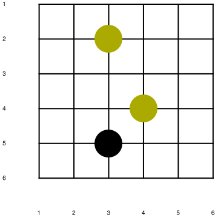
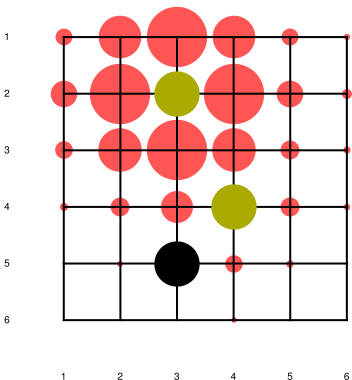
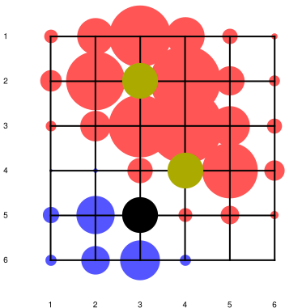
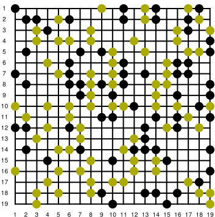
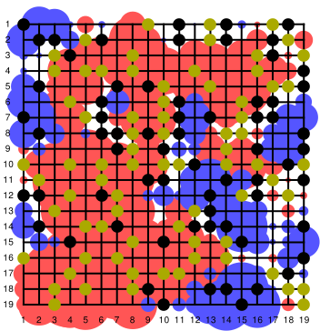

# EntropyGO
We use the concept of entropy maximisation to calculate the influence on a GO board. We provide a Mathematica code and a 
[document](doc/EntropyGO.pdf) explaining the code. We are able to arrive at a simple formula, which can be used to write efficient 
algorithms.

It has been suggested that [maximising entropy](https://journals.aps.org/prl/abstract/10.1103/PhysRevLett.110.168702)
is an "intelligent" move in any game. See [Link between Intelligence and Entropy](https://physics.aps.org/articles/v6/46)
for a light discussion on the topic. 

## Simple example
```
Needs["EntropyGO`", NotebookDirectory[] <> "src/EntropyGO.m"]

Board = {{0, 0, 0, 0, 0, 0}, 
         {0, 0, 1, 0, 0, 0}, 
         {0, 0, 0, 0, 0, 0},
         {0, 0, 0, 1, 0, 0},
         {0, 0,-1, 0, 0, 0},
         {0, 0, 0, 0, 0, 0}};
         
LoadBoard[board] (*loads global varibles such as BoardInfluence*)
Draw[]
```


To draw the influence of the paths from the top white piece:
```
options = {"boardPaths" -> True};
{boardInf, boardPaths} = BoardInfluenceFromGroup[Groups[1][[1]], 1, options];
(*use Group[-1] to access black groups*)

DrawTentacles[boardInf, 3] (*3 inversely specifies how thick the tentacles should be. *)
```


To draw the balance of influence between white and black 
```
DrawTentacles[BoardInfluence, 3]
```


## Big random example
```
GenerateRandomBoard[19]
Draw[]
DrawTentacles[BoardInfluence, 3]
```


