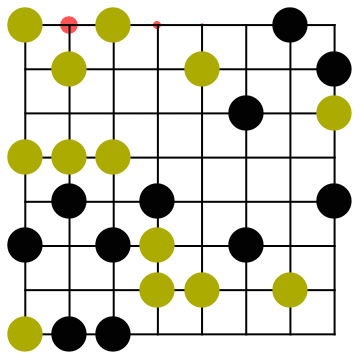
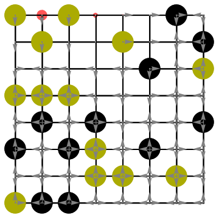
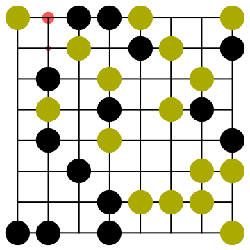
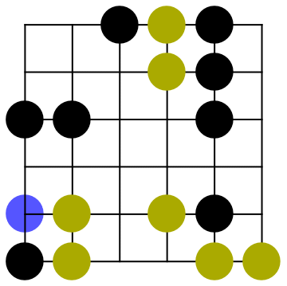

## The maths behind the algorithms

please read [EntropyGO.pdf](EntropyGO.pdf) to learn how to deduce formulas for the influence. These formulas calculate, for every empty space, what is the probability that, say, white can place a piece and that piece will survive.

Below are some gifs that show the inner workings of the algorithm:

 

The algorithm takes each connected group and then calculates all the paths leaving that group, and their influence. The two gifs above show how the influence on the board changes as all paths from all connected groups are calculated. The gif with the arrows is demonstrating the algorithm that checks if all paths have been calculated. It is related to the variable called `linkBoard` and `linkUDRL`. Each element `link={x,y,z,w}` of the matrix `linkUDRL` represents the connected neighboors Up, Down, Left and Right. `link={1,0,-1,0}` means that above is white, below is empty, left is black and right is empty. Links are removed when the paths through them have already been considered. The comments in the code explain this in greater detail. 

Here are more examples:

 

